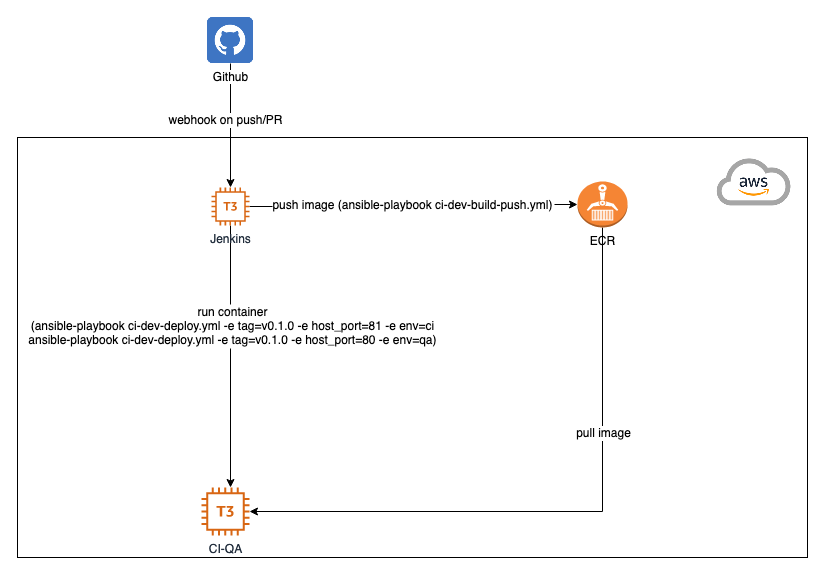

# Stack
- AWS

    EC2 - one instance for Jenkins and one for CI/QA environments

    ECR - as Docker container registry

- Terraform

    List of resources: two EC2 instances, SG, ssh key, ECR registry.

- Ansible

    Playbooks/roles to configure EC2 instances and build/push/deploy Docker images. 
- Docker

    Package, delivery and run application.

- Jenkins

    - Multibranch pipeline job to build/push Docker image and deploy to CI
    - Pipeline job to deploy specific image to QA

# CI/CD flow:
- Push any branch except develop/main - no actions.
- PR created/updated - build/push image to registry.
- Merge to develop/main - build/push image to registry plus deploy to CI.
- Deploy to QA could be triggered manually using separate Jenkins job.

# Deploy
CI and QA envs are located on the same host (CI-QA). CI uses host port 81, QA - 80.
Deploy is implemented by Ansible playbook [ci-dev-deploy.yml](ansible/ci-dev-build-push.yml) 

# Ansible
## Playbooks
[bootstrap.yml](ansible/bootstrap.yml) - install Docker/Jenkins.

[ci-dev-build-push.yml](ansible/ci-dev-build-push.yml) - build/push Docker image.

[ci-dev-deploy.yml](ansible/ci-dev-deploy.yml) - run container.
## Roles
[common](ansible/roles/common) - install needed deb packages.

[docker_install](ansible/roles/docker_install) - install Docker.

[jenkins_install](ansible/roles/jenkins_install) - install Jenkins.

[docker_build_push](ansible/roles/docker_build_push) - build/push Docker image.

[docker_deploy](ansible/roles/docker_deploy) - run container.

## Examples:
Install Docker/Jenkins on Jenkins and CI/Dev instances:
```
ansible-playbook -i ansible/inventory.txt ansible/bootstrap.yml -u ubuntu -b
```

Build/push Docker image:
```
ansible-playbook -i ansible/inventory.txt ansible/ci-dev-build-push.yml -e tag=v0.1.0 
```

Run (deploy) container:
```
ansible-playbook ansible/ci-dev-deploy.yml -i ansible/inventory.txt -u ubuntu -e tag=v0.1.0 -e host_port=81 -e env=ci

ansible-playbook ansible/ci-dev-deploy.yml -i ansible/inventory.txt -u ubuntu -e tag=v0.1.0 -e host_port=80 -e env=qa
```

# Jenkins
There are two jobs in Jenkins. The first - multibranch pipeline job to build/push and run container on CI env, triggered by Github webhook on push/PR ([Jenkinsfile](Jenkinsfile)). The second - parameterized pipeline job which deploys image with tag specified as parameter to QA env ([Jenkinsfile](Jenkinsfile_QA_deploy)).

# links
[Spring-petclinic app](https://github.com/spring-projects/spring-petclinic)

[Jenkins pipeline syntax](https://www.jenkins.io/doc/book/pipeline/syntax/)

[How to Create a GitHub Branch Source Multibranch Pipeline](https://www.youtube.com/watch?v=ZWwmh4gqia4)

[Dockerizing java application ](https://docs.docker.com/language/java/)
